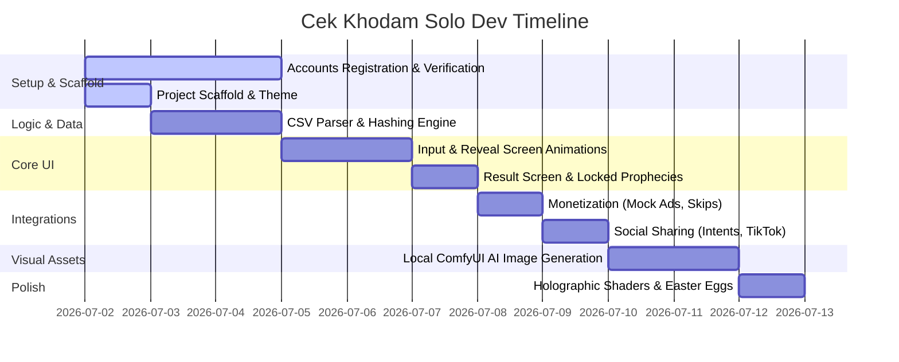

# Cek Khodam: Project Roadmap

A milestone roadmap for a solo developer to build, polish, and launch the **Cek Khodam** Android app starting **2 July 2026**.

## Milestone Overview (Target Launch: 12 July 2026)

---

## Detailed Phases & Checklists

### Phase 0: Developer & Ad Account Setup (Parallel Tasks)
* **Date**: 2 – 5 July 2026 (Runs in parallel with coding)
* **Checklist**:
  - [ ] **Google Play Console**: Register for a Developer Account ($25 one-time fee) and submit identity verification.
  - [ ] **Google AdMob**: Create an AdMob Account, set up the payment profile, and verify your email/phone number.
  - [ ] **Ad Units Creation**: Generate a unique AdMob App ID and create two Ad Unit IDs: one for the **Banner Ad** and one for the **Interstitial Ad**.
  - [ ] **app-ads.txt**: Setup a developer website (can use free options like GitHub Pages) to host the `app-ads.txt` file for ad verification.

### Phase 1: Project Setup & Scaffolding
* **Date**: 2 July 2026
* **Checklist**:
  - [x] Run `android create empty-activity` to scaffold the Kotlin/Compose project structure.
  - [x] Define cosmic color tokens (Deep Space backgrounds, neon glows) in `ui/theme/Color.kt`.
  - [x] Setup mystical Typography configurations (Google Fonts integration if desired) in `ui/theme/Type.kt`.
  - [x] Create `elements.csv`, `beasts.csv`, `jokes.csv`, and `flowers.csv` database templates inside `app/src/main/assets/`.

### Phase 2: Engine & Hashing Logic
* **Dates**: 3 – 4 July 2026
* **Checklist**:
  - [x] Implement data models (`Element`, `Beast`, `Joke`, `Flower`, composite `Khodam`) in `model/Khodam.kt`.
  - [x] Implement CSV asset parser functions using Java `BufferedReader`.
  - [x] Implement SHA-256 seed normalization and positive `BigInteger` conversion.
  - [x] Code the 450-modulo range partition algorithm (`0-299` Element-Beast, `300-349` Jokes, `350-449` Flowers).
  - [x] Build the `MainViewModel` featuring the single `AppState` state machine.

### Phase 3: Core UI Screens
* **Dates**: 5 – 6 July 2026
* **Checklist**:
  - [ ] **Input Screen**: Add Name TextField and date picker selector layout.
  - [ ] **Aura Scanner Button**: Draw the custom fingerprint scanner container on Canvas with custom glowing ring animations and trigger haptic vibrations during holding.
  - [ ] **Reveal Screen**: Program the spinning celestial compass rotation (via InfiniteTransition) and sequence loading text animations.
  - [ ] **Result Screen layout**: Design the card, display dynamic element specific glows, and add progressive linear filling animations for attributes stats bars.

### Phase 4: Monetization & Social Features
* **Dates**: 7 – 8 July 2026
* **Checklist**:
  - [ ] **Ad Banner**: Build the sticky ribbon component loading funny randomized mock advertisements.
  - [ ] **Interstitial Overlay**: Design the mock full-screen game/app ad overlay with countdown timers and closing buttons.
  - [ ] **Skip Credits**: Hook up `SharedPreferences` persistence for storing and modifying the 5 ad-skips credits count.
  - [ ] **Social share intents**: Create package-targeted actions for WhatsApp, Instagram story clipboards, and Facebook.
  - [ ] **TikTok sharing**: Code clipboard text formatter and launch intent targeted to `com.zhiliaoapp.musically`.

### Phase 5: Local AI Image Generation (ComfyUI)
* **Dates**: 9 – 10 July 2026
* **Checklist**:
  - [ ] Setup ComfyUI workflow for Flux.1 or SDXL with batch size = 4.
  - [ ] Input element prompts, generate 4 variants, and select the best one.
  - [ ] Input joke/flower prompts, generate, and select the best ones.
  - [ ] Resize all selected images to square 512x512, export as WebP assets, and add to drawables repository.

### Phase 6: Polish, Shaders, & Launch
* **Dates**: 11 – 12 July 2026
* **Checklist**:
  - [ ] Add the Easter Egg static overrides checking logic for names like *Windah Basudara*.
  - [ ] Write moving iridescent custom shader animations for premium unlocked cards.
  - [ ] Test the entire flow (input -> scanner -> ad -> reveal -> result -> locked -> ads -> unlock -> share).
  - [ ] Build release APK and verify size optimizations.

